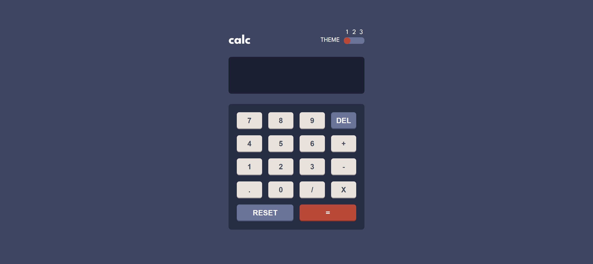

# Frontend Mentor - Calculator app solution

This is a solution to the [Calculator app challenge on Frontend Mentor](https://www.frontendmentor.io/challenges/calculator-app-9lteq5N29). Frontend Mentor challenges help you improve your coding skills by building realistic projects.

## Table of contents

- [Overview](#overview)
  - [The challenge](#the-challenge)
  - [Screenshot](#screenshot)
  - [Links](#links)
- [My process](#my-process)
  - [Built with](#built-with)
- [Author](#author)
- [Acknowledgments](#acknowledgments)

## Overview

### The challenge

Users should be able to:

- See the size of the elements adjust based on their device's screen size
- Perform mathmatical operations like addition, subtraction, multiplication, and division
- Adjust the color theme based on their preference
- **Bonus**: Have their initial theme preference checked using `prefers-color-scheme` and have any additional changes saved in the browser

### Screenshot

### Links

- Solution URL: [solution](https://github.com/jeangu2002/fe-calculator-app)
- Live Site URL: [calculator app](https://jeangu2002.github.io/fe-calculator-app/)

## My process

### Built with

- Semantic HTML5 markup
- CSS custom properties
- Flexbox
- CSS Grid
- Vanilla javascript
- Vite

## Author

- Frontend Mentor - [@jeangu2002](https://www.frontendmentor.io/profile/jeangu2002)
- LinkedIn - [@jean-gustave-nsabiyera-b8018951](https://lu.linkedin.com/in/jean-gustave-nsabiyera-b8018951)

## Acknowledgments

- [JamesIves](https://github.com/JamesIves)'s github pages deploy action was really helpful
- [Barata Ribeiro](https://github.com/Barata-Ribeiro)'s vite community [template](https://github.com/Barata-Ribeiro/vite-vanilla-js-template)
- [Codeium](https://codeium.com/windsurf)
